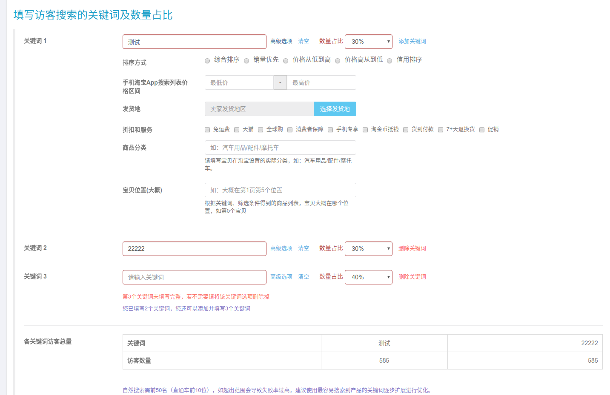
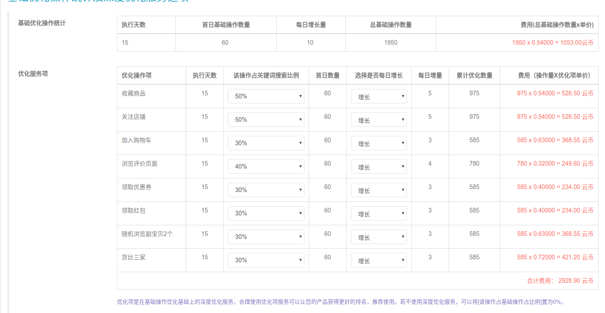
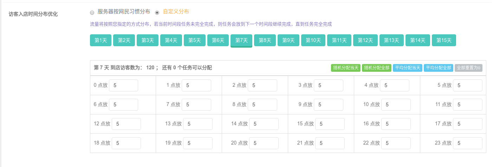
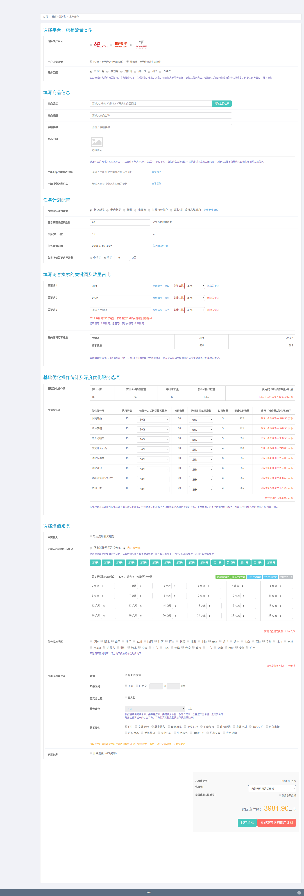

## vue+webpack 模块化开发复杂的单页面
这是本人刚学webpack和vue开发的项目，里面的一些概念还比较落后，比如vue的数据传递方式是用的props...

不过页面中的一些算法和功能还是有点意思

编译后生成的文件在dist目录

webpack已配置好模块化生成文件，便于开发单页应用

## 演示

因为源码是从整个项目拉出来的，所以与服务器交互的数据不完整，遇到错误提示请直接用开发者工具干掉

复杂页面：
http://hookover.github.io/vue-webpack-module-page/dist/create-task.html

动态渲染表单：
http://hookover.github.io/vue-webpack-module-page/dist/create-newmedia-plan.html

## 安装
    git clone 
    npm install         #安装依赖
    npm run web         #编译下面两个模块

## vue开发复杂联动页面 
自动关键字比例及联动计算

价格联动计算

根据总任务数量和时间点进行随机计算

整个页面截图

## vue开发动态表单渲染页面

服务器配置表单信息，页面渲染的表单来自服务器的配置

